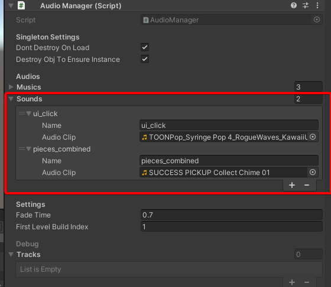
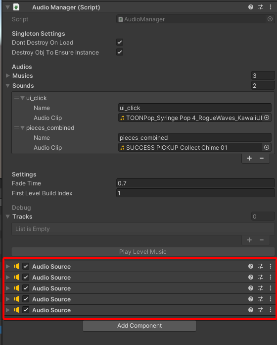
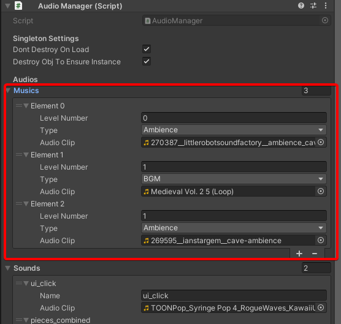
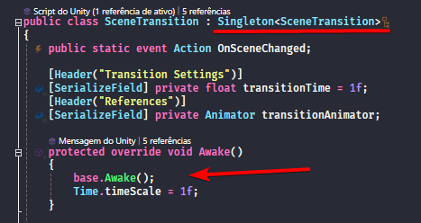
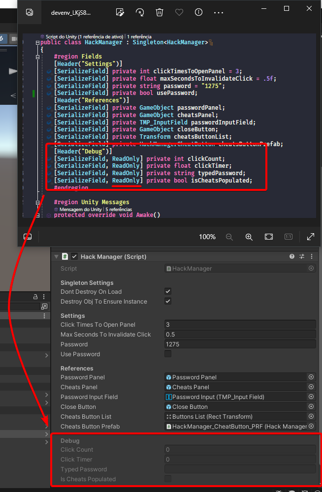
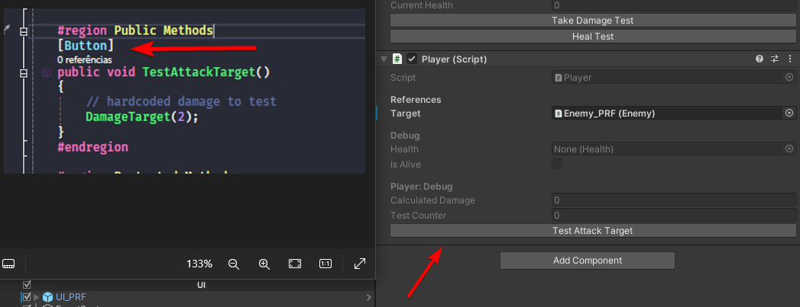
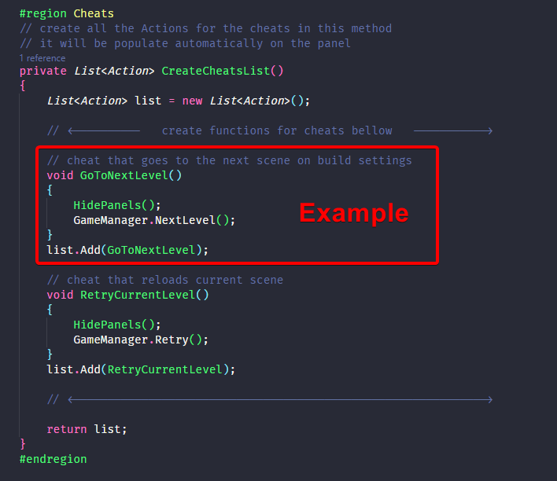

# Puzzle Cave
Projeto do curso de Jogos Digitais, Eixo 2 da PUC Minas.

O jogo é uma combinação de Match-3 com elementos de RPG por turno. O jogador tem um limite de tempo para fazer a maior quantidade possível de pontos, combinando peças no tabuleiro. Com os pontos adquiridos em seu turno você desfere um ataque que reduz a vida do inimigo, porém, logo em seguida, ele desfere um ataque contra o jogador. Ao derrotar o inimigo sem ter sua vida zerada você passa para o próximo nível, e assim sucessivamente até chegar no tesouro.​

### Table of contents
- [Tocar audios](#tocar-audios)
- [Trocas de cena](#trocas-de-cena)
- [Singletons](#singletons)
- [Utilitários](#utilitários)
  - [PlayClickSound.cs](#playclicksoundcs)
  - [NaughtyAttributes](#naughtyattributes)
- [Adicionando hacks](#adicionando-hacks)

## Tocar audios
Para tocar sons eu criei um AudioManager, ele é um singleton então tu pode acessar os métodos usando `AudioManager.Instance.{metodo}`.

Deixei vários métodos prontos nele porém os mais usados vão ser o de `AudioManager.Instance.PlaySound` para tocar um som e continuar tocando, e o de `AudioManager.Instance.PlaySoundOneShot` que vai tocar o som apenas uma vez.

É preciso configurar os audios para tocá-los, uma vez que tu vai chamar o audio pelo nome q tu por na configuração.

Você tbm precisa escolher qual em qual faixa de audio que o som vai ser tocado. Deixei configurado 5 faixas, caso precise adicionar mais, basta adicionar componentes de AudioSource no manager. **Importante: a faixa 1 é reservada para música e a faixa 2 para sons ambientes.**

A configuração de músicas e sons ambientes é um pouco diferente, tu vai colocar qual o index do level em questão e qual o tipo de aúdio. Após isso já é tudo **automático**, assim que um novo level for carregado a música o manager checa e muda a música. O index 0 é reservado para a cena de MainMenu.

## Trocas de cena
As trocas de cena são feitas com transição, o controlador disso é o SceneTransition. Para trocar para qualquer cena é só usar os métodos de `SceneTransition.TransitionToScene` e passar o index da cena.

O GameManager tbm possui alguns métodos utilitários para isso, por ex, o `GameManager.NextLevel()` passa para a próxima cena da lista de build, e o `GameManager.Retry()` recarrega a cena atual.

## Singletons
Pra começo de conversa, sim, Singleton é um anti-pattern e possui vários problemas. Porém para jogos pequenos iguais o que fazemos na faculdade e para game jams tbm é muito util ter um acesso global.

Dito isso, caso queira criar um singleton/manager de acesso static basta tu extender da classe `Singleton<T>`, sendo T a classe que está criando. O único detalhe é que, caso precise utilizar a função *Awake* da unity nesse novo obj tu precisa lembrar de dar override e chamar a `base.Awake()` da classe mãe. Sem isso a instância do singleton não vai inicializar.

## Utilitários

### PlayClickSound.cs
Utilitario pra fazer o setup de tocar o som de click da UI nos botões, basta jogar esse script num mesmo objeto que tem o componente de Button da Unity.

### NaughtyAttributes
O NaughtyAttributes é uma package mt util pra te dar mais controle em cima dos inspetores da Unity, tu pode ver os docs deles com todos os métodos [aqui](https://dbrizov.github.io/na-docs/).

Porém eu costumo usar somente 2 coisas:
- Atributo de **ReadOnly** em fields. Isso permite que variáveis privadas sejam mostradas no inspector mas que não podem ser modificadas. Isso é mt bom pra debuggar sem precisar ficar alterando código e printando logs. 
- Atributo de **Button** em métodos. Isso permite tu expor uma função no inspector da Unity em forma de botão, também é ótimo pra debuggar funcionalidades de uma forma mais rápida. 

## Adicionando hacks
Como estamos desenvolvendo para mobile não é muito util ter hacks para debug usando teclas. Daí eu criei um HackManager que possui uma interface de botões para cada hack que quisermos.

Para acessar os cheats tu precisa clicar rapidamente 3 vezes (configurável) no canto superior esquerdo da tela. Isso evita abrir a interface sem querer. Existe também uma opção para pedir uma senha, adicionando uma camada extra de proteção mas que acho desnecessária.

No código tem uma lista de funções que é lida pelo manager e pra cada função eu instancio um botão na interface do manager. Portanto, para adicionar um novo hack basta criar a função da mesma forma que o exemplo abaixo e adicionar sua função de hack na lista. O resto é automático.

